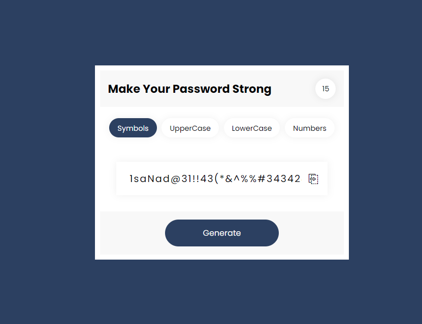

# Random Generate Password Application

This is simple random password generator application using JavaScript. If you have better idea then it. Please feel free to fork it and contribute and also have any suggestion for me please fee free to knock me i always considered strange person advices. thanks

# Using Technologies
 - HTML5/HTML
 - CSS3/CSS
 - Vanilla JavaScript.
 - Dom Manipulations
 - VS Code Editor
 - Git bash / Github
 - Google Fonts (poppins)
 many more...

 # Features
 - You can assign length of your password
 - Also can define how kind of password you need
 - Copy Password to you clipboard
 - Best User Experiences 

 # Demo Preview this project
 

 > Thanks for reach out me on Github
 